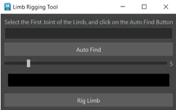

# Maya Plugins 

This is a collection of maya plugins to help with rigging and other stuff 

# How to install: 
drag the install.mel file into maya's viewport, and the tools will appear on the current shelf. 

## Limb Rigger

Rigs any 3 joint limb. 

* Auto find the joints

* Control the controller size 

* Control the controller color 

* Modular approach 